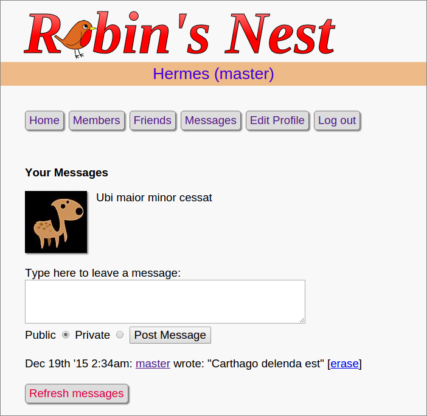

# Parrot

An updated *Robin's Nest*

A small twitter clone created using Robin Nixon's book *Learning PHP, MySQL, & JavaScript* [mini social network final example](http://lpmj.net/) based on current PHP standards:

- PSR-1 and PSR-2 coding standards
- Fixed invalid html strings from '' to ""
- Use jQuery
- PHP and HTML now mostly separated
- Database login/password stored in env variables not in source code
- All pages are viewed through single entry point: index.php
- Removed repeated html header and footer -> consolidated into header.php and footer.php
- Isolated top-level code into init.php:
  *Files SHOULD either declare symbols (classes, functions, constants, etc.) or cause side-effects (e.g. generate output, change .ini settings, etc.) but SHOULD NOT do both.*
- Consolidated all configuration in config.php
- Separated content pages (in *pages* dir) from logic pages
- .js and .css in their own directories
- removed ending ?> when not necessary

The application is to be used in conjunction with my own medium post reharding creating an EC2 AWS instance and running a php applicatin within the cloud. 

The medium post can be found at https://medium.com/@oreillyalan88/lamp-linux-apache-mysql-php-web-server-on-an-amazon-ec2-linux-instance-e37eb023e996
